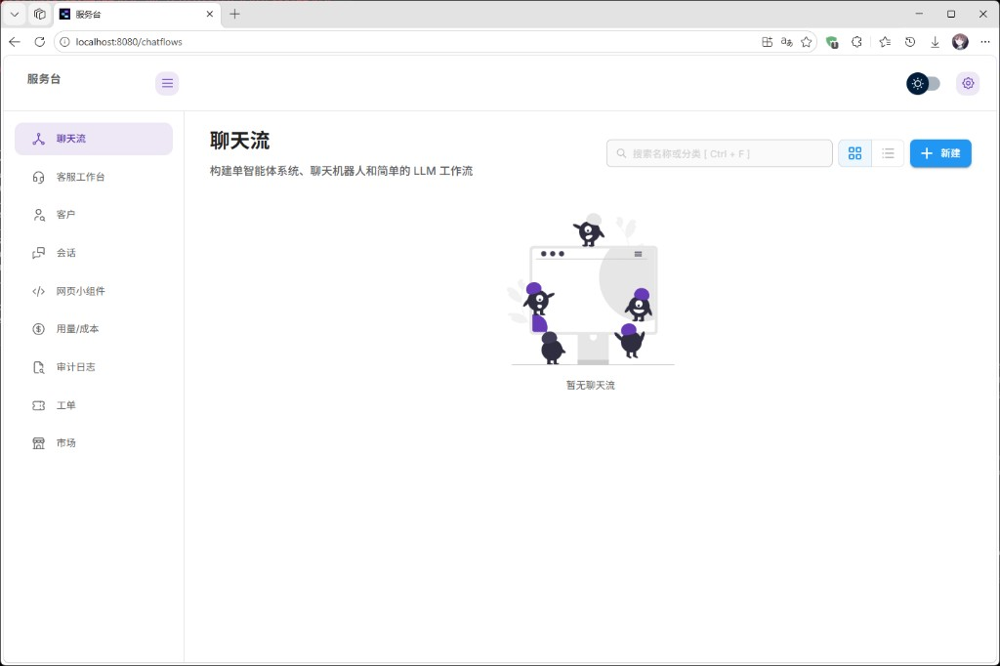
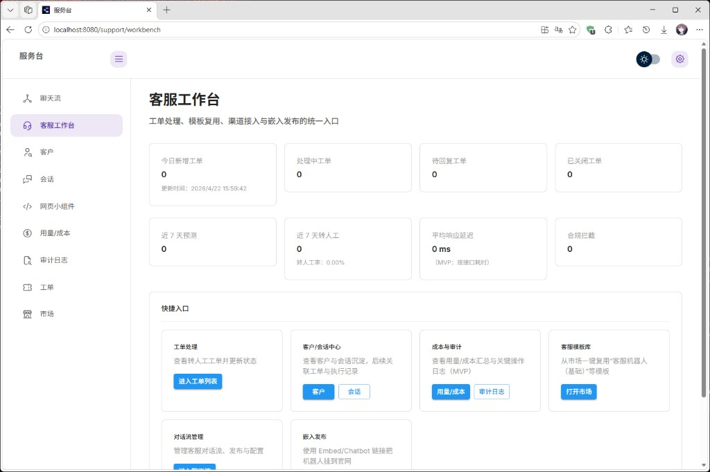
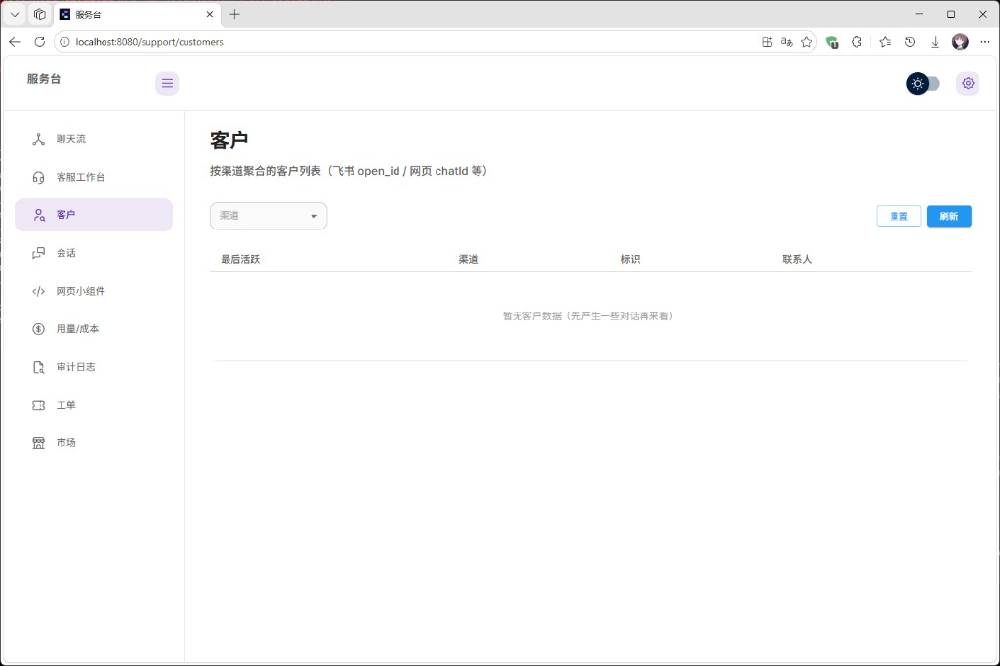
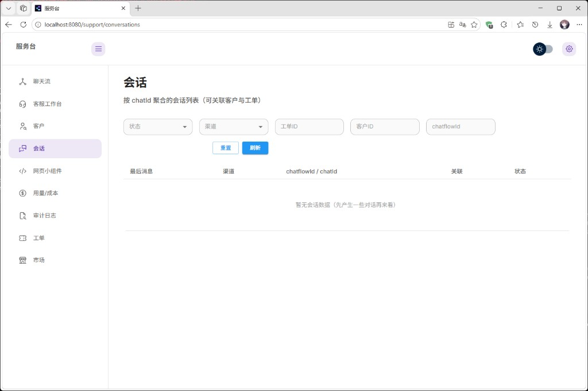
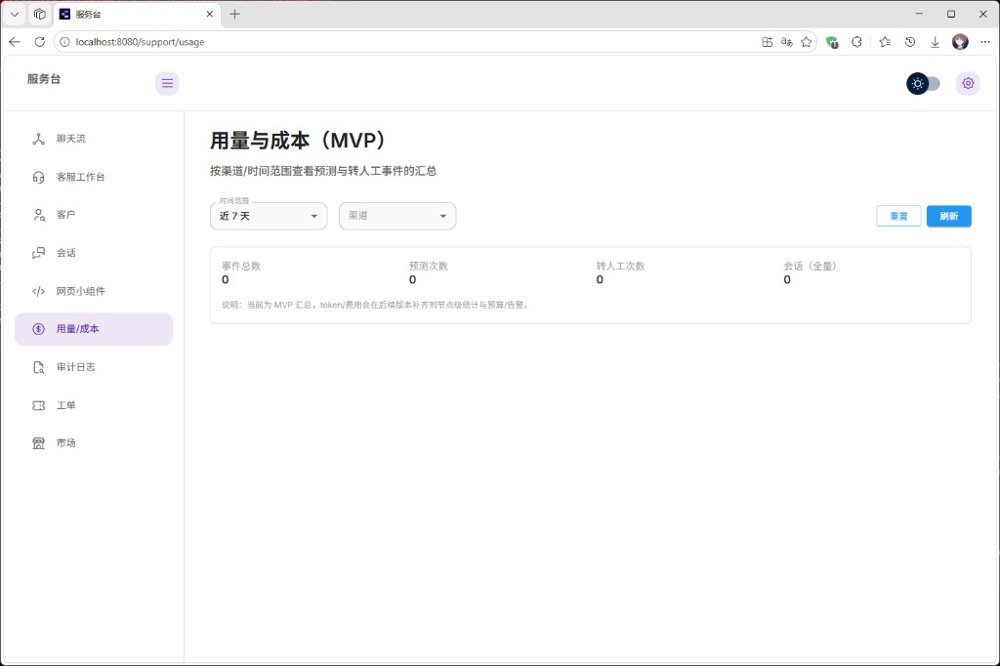
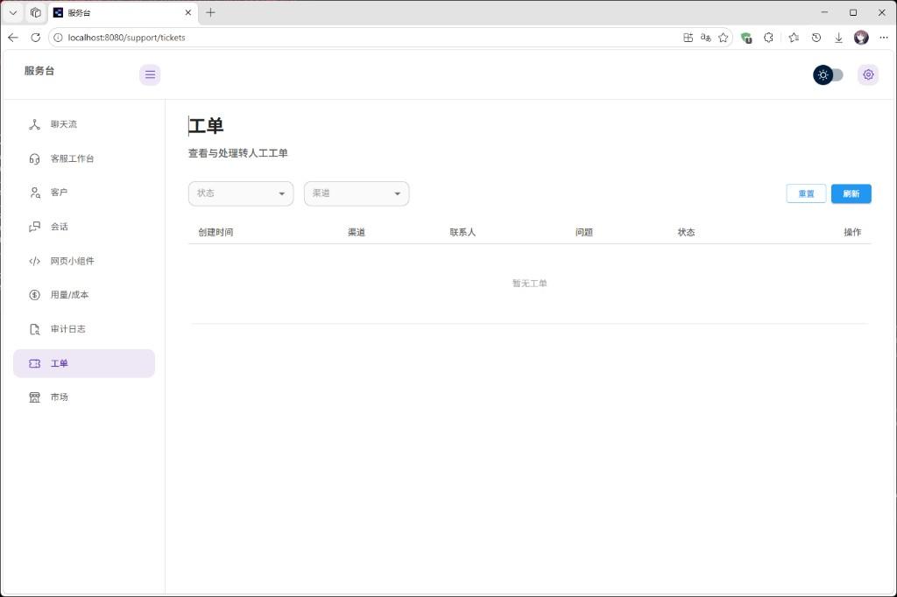
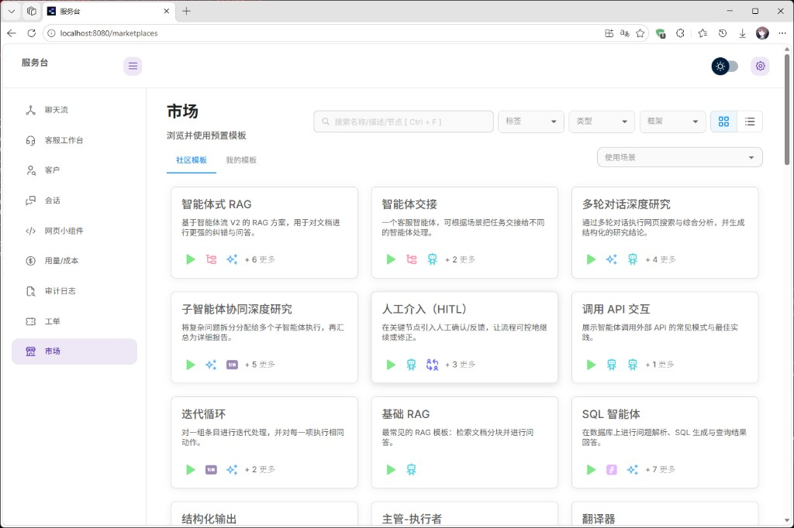

# 服务台（Flowise-plus）

基于 Flowise 深度改造的智能客服工作台，面向企业多渠道客服场景，支持网页小组件与飞书接入，实现「AI 自动回复 + 人工兜底 + 工单闭环 + 运营审计」的一体化服务流程。

## 项目定位

服务台（Flowise-plus）聚焦客服业务落地，不是通用 Demo。项目重点覆盖：

- 会话记忆与知识问答
- 敏感词合规与内容脱敏
- 转人工与工单状态流转
- 客户/会话中心联动
- 用量、延迟、成本统计
- 质检与审计日志
- 工作区隔离（MVP）

## 核心功能

- **多渠道接入**：网页嵌入组件 + 飞书 webhook 适配
- **客服工作台**：客户中心、会话中心、工单管理、运营看板
- **运营治理**：Usage 事件埋点、KPI 汇总、审计事件留痕
- **模型治理**：可基于 Anthropic 兼容网关（如 DashScope）接入模型
- **本地开发友好**：针对 Windows/SQLite 场景做了兼容性修复

## 界面展示

### 1) 聊天流



### 2) 客服工作台



### 3) 客户中心



### 4) 会话中心



### 5) 用量与成本



### 6) 工单管理



### 7) 模板市场



## 快速开始（本地开发）

### 1) 环境要求

- Node.js `>=18.15.0`（推荐 Node 20）
- pnpm `>=10`

### 2) 安装依赖

```bash
pnpm install
```

### 3) 配置环境变量

- `packages/server/.env`（可由 `.env.example` 复制）
- `packages/ui/.env`（可由 `.env.example` 复制）

如需接入 DashScope（Anthropic 兼容）可配置：

```env
ANTHROPIC_AUTH_TOKEN=你的APIKey
ANTHROPIC_BASE_URL=https://dashscope.aliyuncs.com/apps/anthropic
ANTHROPIC_MODEL=qwen3-coder-flash
ANTHROPIC_SMALL_FAST_MODEL=qwen-math-turbo
ANTHROPIC_MAX_TOKENS=4096
ANTHROPIC_TEMPERATURE=0.1
ANTHROPIC_TOP_P=0.9
```

### 4) 启动开发模式

```bash
pnpm dev
```

默认访问：

- UI: `http://localhost:8080`
- Server: `http://localhost:3000`

## 仓库与分支

- 当前仓库：`https://github.com/yanyu53/Flowise-Service-Desk`
- 建议将你自己的业务分支设为默认分支，避免首页继续显示 `main` 的旧内容

## 来源说明

本项目基于 Flowise 二次开发，保留原项目开源协议与必要引用。

- Upstream: `https://github.com/FlowiseAI/Flowise`

## License

本仓库遵循 [Apache License 2.0](LICENSE.md)。
